# terminal-setup

One-shot macOS terminal setup. Run one script on a fresh Mac and get the whole
environment back — tools, runtimes, fonts, shell plugins, and all config files —
without redoing it by hand.

## Screenshots

| | |
|---|---|
| 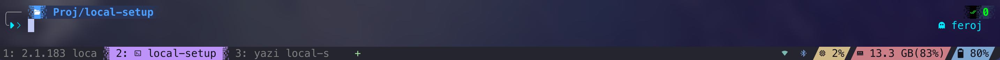 | 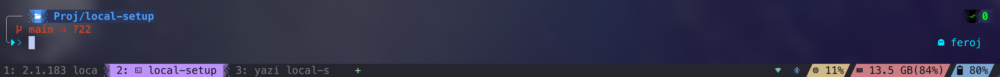 |
| **starship** prompt + wezterm tab bar | dirty-tree git status in the prompt |
| 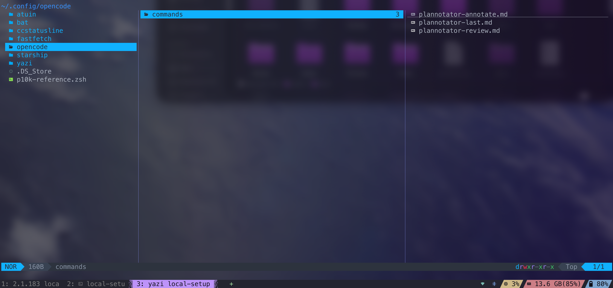 | 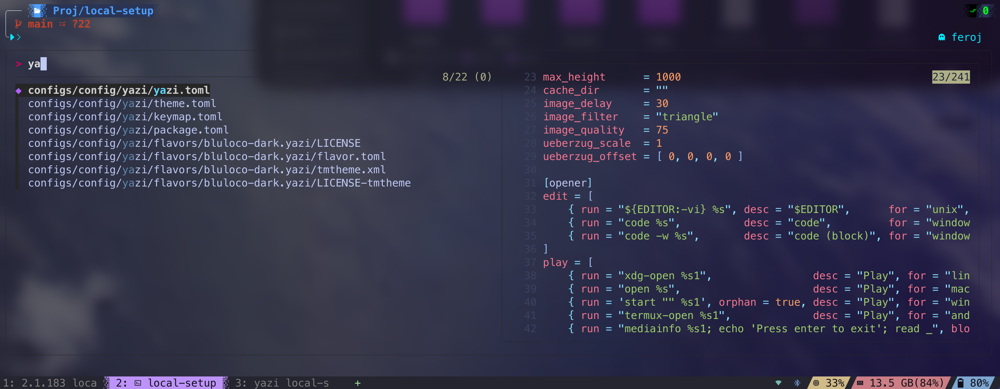 |
| **yazi** file manager (preview pane) | **fzf** finder with **bat** preview |
| 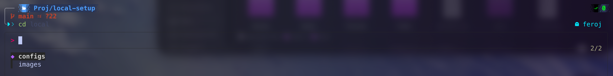 | 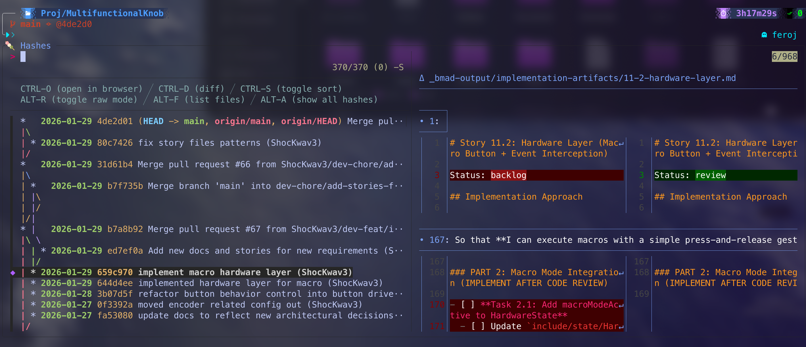 |
| interactive `cd` completion | **fzf-git** commit browser |
| 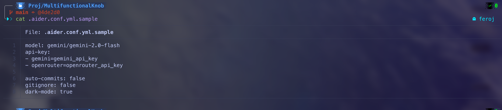 | 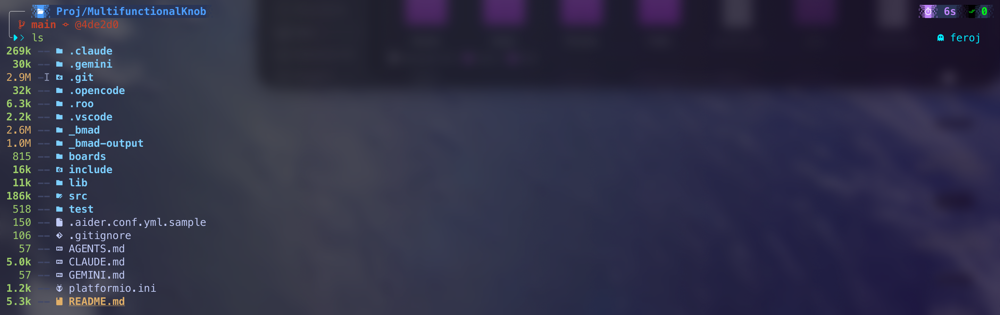 |
| **bat** syntax highlighting (`cat`) | **eza** listing (`ls`) |
| 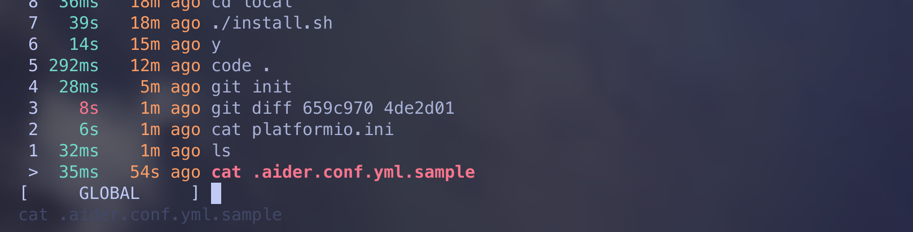 | 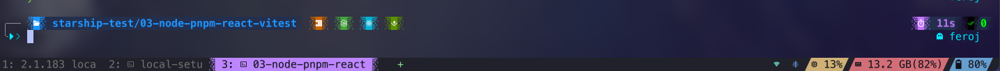 |
| **atuin** history search (Ctrl-R) | **starship** in a Node/pnpm project |
| 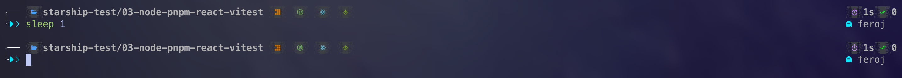 | 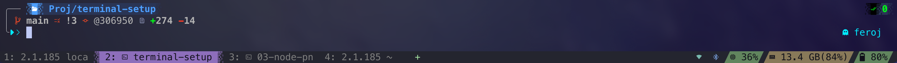 |
| toolchain icons (pnpm/React/Vitest) | git details + **wezterm** tab bar & status pills |

## Usage

```bash
git clone <this-repo> terminal-setup     # or copy the folder over
cd terminal-setup
./install.sh
```

The installer is **interactive and safe to re-run**. After bootstrap (Xcode CLT →
Homebrew → figlet) it walks **four segments**, each prompting before it acts:

1. **Terminal** — wezterm + the tools its config needs (Nerd Fonts, blueutil,
   fastfetch) + `.wezterm.lua` / fastfetch config.
2. **Shell** — oh-my-zsh + everything `.zshrc` integrates (starship, atuin, bat,
   eza, zoxide, fzf, fd, ripgrep, jq, yazi, runtimes, …) + the `.config/*` configs.
3. **Git** — identity + optional SSH key + git-delta (applied via `git config --global`).
4. **Claude Code** — CLI + plugins + node shim + `~/.claude/settings.json`.

Notes:
- Each segment lists exactly what it installs and configures before you confirm.
- The shell/terminal tools and their configs install **together** (a config without
  its tools breaks the shell/terminal), so those segments are all-or-nothing.
- Anything already present is skipped; configs are never overwritten silently
  (`keep / overwrite / diff`). It ends with a summary of what was done.

After it finishes: restart the terminal (or `source ~/.zshrc`) and select
**MesloLGS Nerd Font** in your terminal app.

## What it installs

**Bootstrap** (in order): Xcode Command Line Tools → Homebrew → figlet.

**Runtimes** (curl installers): `nvm` + an LTS `node` (+ a `~/.local/bin/node` shim
so non-interactive shells/hooks find node), `bun`, `uv`.

**Homebrew formulae:**

| Tool | Purpose |
|------|---------|
| yazi (+ ffmpeg, poppler, resvg, imagemagick, sevenzip) | terminal file manager + file previews |
| atuin | shell history search (Ctrl-R) |
| bat | `cat` with syntax highlighting (aliased to `cat`) |
| eza | modern `ls` (aliased to `ls`) |
| starship | shell prompt |
| git-delta | git diff pager (wired via `git config --global`) |
| fastfetch | system info display |
| blueutil | Bluetooth control from the CLI |
| terminal-notifier | desktop notifications (omz `bgnotify`) |
| figlet | ASCII banners (used by the installer) |
| fzf | fuzzy finder (shell plugin, fzf-git, previews) |
| zoxide | smarter `cd` (aliased `cd`→`z`) |
| fd | fast file find |
| ripgrep | fast recursive grep |
| jq | JSON processor |

**Casks:** `font-meslo-lg-nerd-font`, `font-symbols-only-nerd-font`, `wezterm`.

**Claude Code** (native installer): the `claude` CLI, plus marketplaces + plugins
(`superpowers`, `typescript-lsp`, `caveman`, `plannotator`) wired up via
`claude plugin`, and a portable `~/.claude/settings.json`.

**oh-my-zsh custom plugins** (git clone): `zsh-autosuggestions`,
`fast-syntax-highlighting`.

**Other:** clones `fzf-git.sh` to `~/Documents/Tools/` (sourced by `.zshrc`).

## Config deployment

Configs live in `configs/` and are copied to their destinations during each segment:

```
configs/home/   → $HOME            (.zshrc, .wezterm.lua)
configs/config/ → $HOME/.config    (atuin, bat, fastfetch, starship, yazi)
configs/claude/ → $HOME/.claude    (settings.json)
```

For each file that already exists you choose:

- **k** — keep the existing file
- **o** — overwrite (the old file is backed up to `<file>.bak.<timestamp>` first)
- **d** — show a diff, then ask again

**Git:** no `.gitconfig` is copied — that would clobber a machine's existing git
policy. The Git segment instead sets only what we need via `git config --global`:
your name/email, `diff.colorMoved`, and (if you install git-delta) delta's pager
settings. It can also generate an `ed25519` SSH key named per a context you give
(e.g. `id_ed25519_personal`) and print the public key.

**Claude Code:** `configs/claude/settings.json` is portable (no machine-specific
paths) — caveman runs via its plugin + the node shim rather than absolute-path hooks.

### Starship prompt style

After deploying configs, the installer offers two independent choices for the
starship prompt and rewrites the deployed `starship.toml` to match:

- **Tool versions** — `icon` (icon only, default) or `verbose` (icon + the
  detected tool/language version).
- **Color scheme** — `colorful` (brand colors, default) or `lesscolor` (a uniform
  grey + dim-white look).

Press Enter twice to keep the shipped look (colorful + icon-only); the file is
left untouched in that case. The prompt is also skipped if you chose to **keep**
an existing/customized `starship.toml` — only a freshly deployed copy that matches
the repo baseline is rewritten. Every module carries all of its alternates as
commented blocks (`v1`/`v2`/`verbose`/`v4`), so the repo copy is always the
baseline and the transform is deterministic and safe to re-run. To switch later,
just re-run `./install.sh` (or flip the blocks in `~/.config/starship/starship.toml`
by hand). wezterm has no such toggle — its style is fixed.

## Notes & gotchas

- **macOS only**, Apple Silicon assumed (Homebrew at `/opt/homebrew`).
- **bat theme:** uses a custom `tokyonight_night` theme; the installer runs
  `bat cache --build` automatically at the end.
- **yazi theme:** the active flavor is `bluloco-dark` (set in
  `configs/config/yazi/theme.toml`). Flavors are vendored, so no extra download.
- **nvm / bun / uv** are lazy-loaded in `.zshrc` — first use initializes them.
- **node shim:** because nvm exposes `node` only as a lazy interactive function,
  non-interactive `/bin/sh` hooks (e.g. Claude/caveman) can't find it. The installer
  drops a `~/.local/bin/node` shim that resolves the newest nvm node at call time.
- **Not included:** `opencode` config is intentionally left out of scope. (Claude
  Code *is* now set up; `ccstatusline` runs via `bunx`, so it needs no vendored file.)
- **Backups:** any overwritten config leaves a timestamped `.bak` next to it; clean
  those up yourself once you're happy.

## Updating the repo from your machine

Edit files under `configs/` directly (not `~`). Keep the tree clean — no
`.DS_Store`, `*.bak`, `.git` dirs, or theme `preview.png`/`README.md`. For yazi,
keep only the active flavor and update `theme.toml` + `package.toml` to match.

## Repo layout

```
install.sh    # the entire installer (single file, bash 3.2-safe)
configs/      # config files deployed to $HOME, $HOME/.config, $HOME/.claude
images/       # screenshots used in this README
CLAUDE.md     # guidance for AI agents working in this repo
README.md     # this file
```
